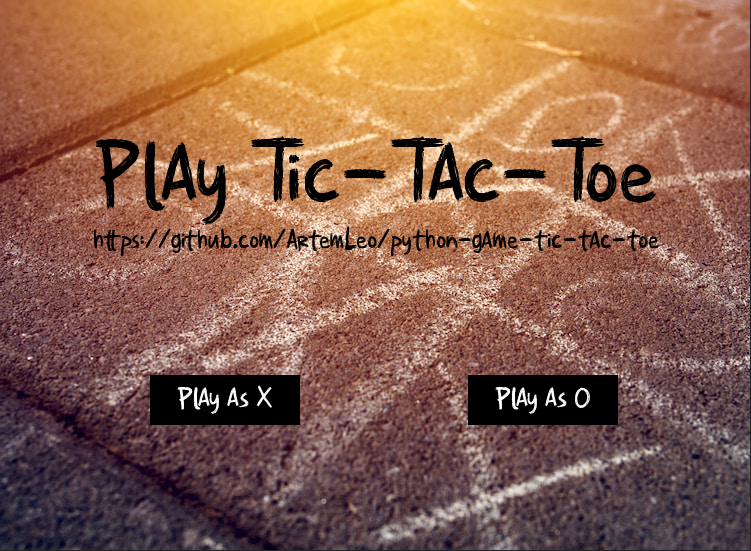
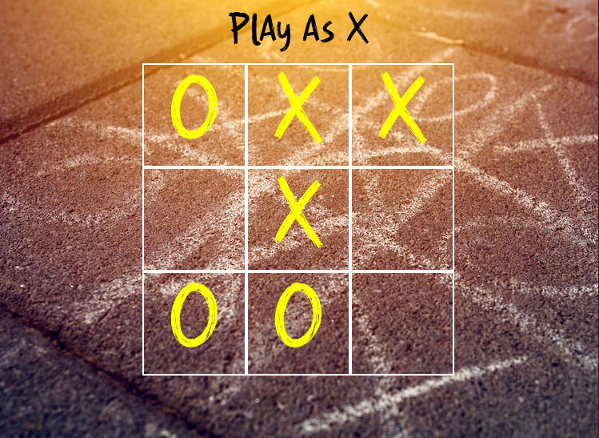
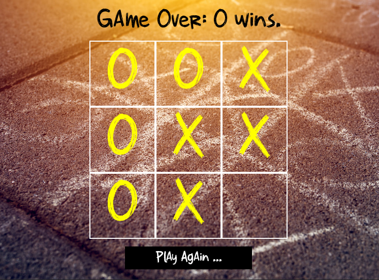
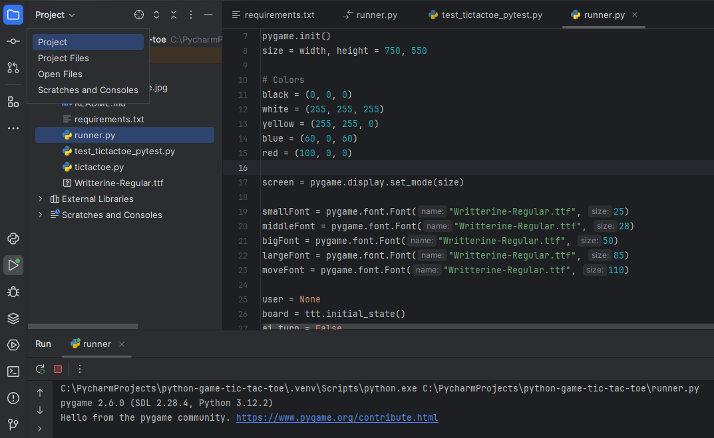

# 🧩 Tic-Tac-Toe ❌ ⭕️

### Description 🧩 🎮:

Tic-Tac-Toe AI is a Python game where you play Tic-Tac-Toe against an AI opponent. Challenge yourself and see if you can
beat the machine! This will start the game and prompt you to make a move. The AI will make its move automatically after
you.

---

### Game Images 🧩 🎮:





---

### To START Playing 🧩 🎮:

<ul>
    <li><strong>Install Python 3.10 +</strong></li>
    <li><strong>Clone the Repository</strong></li>
    <li><strong>Run the Application</strong></li>
    <li><strong>Feel free to Explore and Contribute!</strong></li>
</ul>

```shell
# Clone the repository
git clone https://github.com/ArtemLeo/python-game-tic-tac-toe
```

```shell
# Configure a virtual environment
(for Windows)
python -m venv venv
source venv/Scripts/activate

(for Mac/Linux)
python3 -m venv venv
source venv/bin/activate
```

```shell
# Install the necessary libraries
python -m pip install --upgrade pip
pip install -r requirements.txt
pip install pygame
```

```shell
# Run the game
python runner.py
```

---





---
